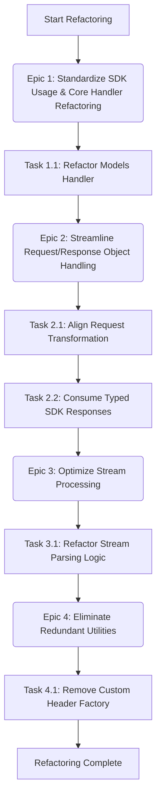

### Product Requirements Document: OpenAI-to-Gemini Worker - Deeper js-genai Integration

#### **1. Introduction**

This document outlines the requirements for refactoring the existing Cloudflare worker application. The worker serves as a compatibility layer, translating API requests from the OpenAI format to Google's Gemini API format and vice-versa. The primary goal of this refactoring is to leverage the [`@google/generative-ai`](package.json) (js-genai) SDK (version `^0.24.1` as per [`package.json`](package.json)) more comprehensively. This will simplify the codebase, reduce manual implementation of API interaction logic, improve maintainability, and enhance overall robustness by aligning more closely with the SDK's intended usage patterns.

#### **2. Goals**

*   **Reduce Boilerplate:** Minimize custom code for direct Gemini API calls, header management, and stream parsing.
*   **Improve Code Clarity:** Make the interaction with the Gemini API more explicit and easier to understand by using SDK methods and types.
*   **Enhance Maintainability:** Shift the burden of low-level API communication details to the js-genai SDK, simplifying future updates.
*   **Ensure Consistency:** Centralize all Gemini API interactions through the js-genai client instance.
*   **Leverage SDK Capabilities:** Utilize built-in SDK features for request/response handling and stream processing.

#### **3. Target User (for this PRD)**

An AI coding agent capable of:

*   Understanding and modifying JavaScript (`.mjs`) modules.
*   Analyzing existing code structures and dependencies within the provided codebase.
*   Refactoring code to integrate an SDK according to specified patterns and features documented in the js-genai library (using version `0.24.1`).

#### **4. Refactoring Flow Overview**

The refactoring will proceed through the following logical epics, with tasks designed for subtasking and sequential execution:

#### **5. Requirements (Epics & Detailed Tasks)**

This refactoring is broken down into the following epics and detailed tasks:

**Epic 1: Standardize SDK Usage & Core Handler Refactoring**
*Goal: Ensure all direct Gemini API interactions are performed via the js-genai SDK client.*

**Task 1.1: Refactor Models Handler (`src/handlers/models.mjs`) to Use js-genai SDK**

*   **Affected File(s):**
    *   [`src/handlers/models.mjs`](src/handlers/models.mjs)
    *   [`src/worker.mjs`](src/worker.mjs)
*   **Current Implementation:** The `handleModels` function in `src/handlers/models.mjs` makes a direct Workspace call to the Gemini `/models` endpoint and uses a custom `makeHeaders` utility.
*   **js-genai Feature to Use:** The `GoogleGenerativeAI` client instance (available as `genAI`) provides a method to list models (e.g., `genAI.listModels()`). This method is part of the `ModelsService` used internally by the SDK (see `js-genai/src/models.ts` for `this.modelsService.list()` and `js-genai/src/client.ts` for how `GoogleGenAI` exposes model services).
*   **Refactoring Steps:**
    1.  **Modify [`src/worker.mjs`](src/worker.mjs):** Ensure the `genAI` instance (initialized with `new GoogleGenerativeAI(env.GOOGLE_API_KEY)`) is passed as an argument to the `handleModels` function. This will align its signature with `handleCompletions` and `handleEmbeddings`. The `apiKey` parameter currently passed to `handleModels` might become redundant if `genAI` encapsulates the key.
    2.  **Modify [`src/handlers/models.mjs`](src/handlers/models.mjs):**
        *   Update the function signature to accept the `genAI` instance.
        *   Remove the direct `Workspace` call to `${BASE_URL}/${API_VERSION}/models`.
        *   Remove the `import` and usage of `makeHeaders` from `../utils/auth.mjs`.
        *   Call the appropriate model listing method on the `genAI` instance (e.g., `await genAI.listModels()`).
        *   The SDK's model listing method will return a list of `Model` objects (defined in `js-genai/src/types.ts`). Adapt the existing transformation logic to iterate over this SDK response and format it into the OpenAI-compatible model list structure.
        *   Ensure that the `id` is correctly derived (e.g., `model.name` from the SDK response, potentially stripping a prefix if needed, similar to the current `name.replace("models/", "")`).
*   **Acceptance Criteria:**
    *   The `/models` endpoint successfully returns a list of models in the OpenAI format.
    *   The underlying call to fetch models from Gemini is made using the js-genai SDK instance.
    *   The manual `Workspace` call and `makeHeaders` usage are removed from [`src/handlers/models.mjs`](src/handlers/models.mjs).
    *   The `genAI` instance from [`src/worker.mjs`](src/worker.mjs) is utilized in `handleModels`.

**Epic 2: Streamline Request/Response Object Handling**
*Goal: Utilize js-genai's typed interfaces for constructing requests and processing responses, reducing manual JSON shaping.*

**Task 2.1: Align Request Transformation with js-genai Input Types**

*   **Affected File(s):**
    *   [`src/transformers/request.mjs`](src/transformers/request.mjs)
    *   [`src/handlers/completions.mjs`](src/handlers/completions.mjs)
    *   [`src/handlers/embeddings.mjs`](src/handlers/embeddings.mjs)
*   **Current Implementation:** Functions in `src/transformers/request.mjs` (like `transformRequest`, `transformMessages`, `transformConfig`, `transformTools`, `transformMsg`) manually construct the JSON objects that are sent as the body in `Workspace` calls or to SDK methods.
*   **js-genai Feature to Use:** The SDK defines specific TypeScript interfaces for request parameters (e.g., `GenerateContentRequest`, `EmbedContentRequest`, `Content`, `Part`, `Tool`, `FunctionDeclaration`, `GenerationConfig`, `SafetySetting`). These are found in `js-genai/src/types.ts`. Helper functions like `createModelContent`, `createUserContent`, `createPartFromText`, `createPartFromFunctionCall` are also available (documented in `js-genai/docs/functions/...` and defined in `js-genai/src/types.ts`).
*   **Refactoring Steps:**
    1.  Review each transformation function in [`src/transformers/request.mjs`](src/transformers/request.mjs).
    2.  Modify these functions so that their output objects are structured to match the corresponding js-genai interfaces.
    3.  For `transformMessages`: The output `contents` array should contain `Content` objects, and parts within them should be `Part` objects. Use helpers like `createPartFromText` or structure them according to `Part` interface (`{text: "..."}`, `{inlineData: {...}}`, `{functionCall: {...}}`, etc.).
    4.  For `transformConfig`: The output `generationConfig` object should match js-genai's `GenerationConfig` interface.
    5.  For `transformTools`: The output `tools` array should contain `Tool` objects, and `toolConfig` should match `ToolConfig`.
    6.  The main `transformRequest` function will then aggregate these typed parts into a complete `GenerateContentRequest` (for completions) or `EmbedContentRequest` (for embeddings).
    7.  In [`src/handlers/completions.mjs`](src/handlers/completions.mjs) and [`src/handlers/embeddings.mjs`](src/handlers/embeddings.mjs), the `body` variable (which is the result of `await transformRequest(...)`) will now be a structured object matching the SDK's request type. This object can be directly passed to `geminiModel.generateContent(body)`, `geminiModel.generateContentStream(body)`, or `geminiModel.embedContent(body)`.
*   **Acceptance Criteria:**
    *   The `transformRequest` function and its helpers in [`src/transformers/request.mjs`](src/transformers/request.mjs) produce objects that are directly compatible with the js-genai SDK methods' parameter types.
    *   The handlers (`handleCompletions`, `handleEmbeddings`) pass these structured objects to the SDK.
    *   Functionality of chat completions and embeddings remains unchanged.

**Task 2.2: Consume Typed SDK Responses in Transformers**

*   **Affected File(s):** [`src/transformers/response.mjs`](src/transformers/response.mjs)
*   **Current Implementation:** Functions like `processCompletionsResponse` and `processEmbeddingsResponse` currently expect and parse raw JSON (or objects derived from raw JSON) from the Gemini API.
*   **js-genai Feature to Use:** SDK methods (e.g., `generateContent`, `embedContent`) return `Promise`-wrapped, structured, and typed response objects (e.g., `GenerateContentResponse`, `EmbedContentResponse` as defined in `js-genai/src/types.ts`).
*   **Refactoring Steps:**
    1.  Identify that in [`src/handlers/completions.mjs`](src/handlers/completions.mjs), `response.response` (for non-streaming) is already the structured `GenerateContentResponse` from the SDK. Similarly for [`src/handlers/embeddings.mjs`](src/handlers/embeddings.mjs), `response` from `geminiEmbeddingsModel.embedContent()` is the structured `EmbedContentResponse`.
    2.  Modify `processCompletionsResponse` in [`src/transformers/response.mjs`](src/transformers/response.mjs) to accept this `GenerateContentResponse` object directly as its `data` parameter (instead of needing `JSON.parse` on text).
    3.  Modify `processEmbeddingsResponse` to accept the `EmbedContentResponse` object directly as its `data` parameter.
    4.  Adapt the internal logic of these and other relevant functions (e.g., `transformCandidates`, `transformUsage`) to access fields from these typed SDK response objects instead of assuming generic JSON object structures.
*   **Acceptance Criteria:**
    *   Response transformation functions in [`src/transformers/response.mjs`](src/transformers/response.mjs) operate on the typed response objects returned by the js-genai SDK.
    *   No `JSON.parse` is needed on the direct output of non-streaming SDK calls within the handlers before passing to these transformers.
    *   The final OpenAI-formatted response remains correct.

**Epic 3: Optimize Stream Processing**
*Goal: Simplify stream handling by leveraging the SDK's parsed stream output.*

**Task 3.1: Refactor Stream Parsing Logic in `src/transformers/stream.mjs`**

*   **Affected File(s):**
    *   [`src/transformers/stream.mjs`](src/transformers/stream.mjs)
    *   [`src/handlers/completions.mjs`](src/handlers/completions.mjs)
    *   [`src/constants/index.mjs`](src/constants/index.mjs) (potentially, for `RESPONSE_LINE_REGEX`)
*   **Current Implementation:**
    *   In `src/handlers/completions.mjs`, the stream from `geminiModel.generateContentStream()` is piped through a `TransformStream` that uses `parseStream` and `parseStreamFlush` from `src/transformers/stream.mjs`.
    *   `parseStream` uses `RESPONSE_LINE_REGEX` to manually parse SSE data lines from the incoming chunk.
*   **js-genai Feature to Use:** The `GenerativeModel.generateContentStream()` method returns an `AsyncGenerator<StreamGenerateContentResponse>`. This means the SDK itself handles the underlying SSE parsing and yields a stream of fully parsed `StreamGenerateContentResponse` objects (see `js-genai/src/types.ts`).
*   **Refactoring Steps:**
    1.  In [`src/handlers/completions.mjs`](src/handlers/completions.mjs), recognize that `rawResponse` (which is `response.stream` from `geminiModel.generateContentStream()`) is already an `AsyncGenerator<StreamGenerateContentResponse>`.
    2.  The first `TransformStream` in `handleCompletions` (the one that uses `parseStream` and `parseStreamFlush`) is largely redundant because the SDK has already parsed the SSE events into objects. This `TransformStream` should be removed.
    3.  The subsequent `TransformStream` (which uses `toOpenAiStream` and `toOpenAiStreamFlush`) should be directly piped from `rawResponse`.
    4.  Modify `toOpenAiStream` in [`src/transformers/stream.mjs`](src/transformers/stream.mjs):
        *   Its first parameter (`line`) will no longer be a JSON string needing `JSON.parse()`. It will directly be a `StreamGenerateContentResponse` object.
        *   Remove the `try...catch` block responsible for `JSON.parse(line)` and the associated error handling for parsing failures.
        *   The logic within `toOpenAiStream` should then directly use the fields from the input `StreamGenerateContentResponse` object (e.g., `data.candidates`, `data.promptFeedback`).
    5.  The `parseStream`, `parseStreamFlush` functions in [`src/transformers/stream.mjs`](src/transformers/stream.mjs) can be removed.
    6.  If `RESPONSE_LINE_REGEX` in [`src/constants/index.mjs`](src/constants/index.mjs) is no longer used elsewhere, it can also be removed.
*   **Acceptance Criteria:**
    *   The custom SSE parsing logic (functions `parseStream`, `parseStreamFlush`, and constant `RESPONSE_LINE_REGEX`) is removed from the codebase.
    *   The `toOpenAiStream` function is simplified to work directly with `StreamGenerateContentResponse` objects yielded by the js-genai SDK.
    *   Streaming chat completions continue to function correctly, producing the OpenAI SSE format.

**Epic 4: Eliminate Redundant Utilities**
*Goal: Remove custom utility functions whose functionality is provided by the js-genai SDK.*

**Task 4.1: Remove Custom Header Factory (`src/utils/auth.mjs`)**

*   **Affected File(s):**
    *   [`src/utils/auth.mjs`](src/utils/auth.mjs)
    *   Any file importing `makeHeaders` (e.g., previously [`src/handlers/models.mjs`](src/handlers/models.mjs)).
*   **Current Implementation:** The `makeHeaders` function in `src/utils/auth.mjs` manually creates an object with `x-goog-api-key` and `x-goog-api-client` headers. The `API_CLIENT` constant is defined in [`src/constants/index.mjs`](src/constants/index.mjs).
*   **js-genai Feature to Use:** The `GoogleGenerativeAI` client instance, when initialized with an API key, automatically includes the necessary authentication (`x-goog-api-key`) and client identifier (`x-goog-api-client`) headers in its requests. This is handled by the internal `APIClient` (see `js-genai/src/_api_client.ts`).
*   **Refactoring Steps:**
    1.  Delete the `makeHeaders` function from [`src/utils/auth.mjs`](src/utils/auth.mjs).
    2.  Remove any imports and usages of `makeHeaders` from other files (this should primarily be [`src/handlers/models.mjs`](src/handlers/models.mjs) after it's refactored per Task 1.1).
*   **Acceptance Criteria:**
    *   The `makeHeaders` function is completely removed from the codebase.
    *   All API calls made via the js-genai SDK continue to be authenticated correctly.
    *   The `API_CLIENT` constant in [`src/constants/index.mjs`](src/constants/index.mjs) might also become unused by the application code if `makeHeaders` was its only consumer directly using it. (The SDK has its own internal version).

#### **6. Out of Scope**

*   **Migration to TypeScript:** This refactoring will focus on JavaScript (`.mjs`) files. However, the changes will align the code structure more closely with js-genai's TypeScript interfaces, making a future migration easier.
*   **Fundamental Translation Logic:** The specific mappings from OpenAI request fields to Gemini request fields (and vice-versa for responses) will largely remain the same. This plan focuses on how these mapped objects are constructed and passed to/from the SDK.
*   **"Thinking Modes" Core Logic:** The custom logic for parsing model name suffixes (e.g., `-thinking-high`), determining budget levels, and processing `<thinking>` tags (implemented in [`src/utils/helpers.mjs`](src/utils/helpers.mjs)) is a unique feature of this adapter. It will be preserved, ensuring it correctly populates js-genai's `ThinkingConfig` where appropriate.
*   **Multi-API Key Strategy:** The `getRandomApiKey` function in [`src/utils/auth.mjs`](src/utils/auth.mjs) will remain as it implements a custom strategy for selecting one API key from multiple configured keys. The selected key is then used to initialize the `GoogleGenerativeAI` instance.
*   **Cloudflare-Specific Code:** Utilities related to Cloudflare Workers environment, such as D1 database interactions (e.g., [`src/utils/database.mjs`](src/utils/database.mjs)) or basic CORS header setup (e.g., [`src/utils/cors.mjs`](src/utils/cors.mjs)), are not affected by js-genai integration.
*   **Adding New Endpoints or Features:** This plan is focused on refactoring existing functionality.

#### **7. Success Metrics**

*   **Code Reduction:** Measurable decrease in lines of code, particularly in:
    *   [`src/handlers/models.mjs`](src/handlers/models.mjs) (due to removal of manual fetch)
    *   [`src/transformers/stream.mjs`](src/transformers/stream.mjs) (due to removal of `parseStream` and related logic)
    *   [`src/utils/auth.mjs`](src/utils/auth.mjs) (due to removal of `makeHeaders`)
*   **Functional Parity:** All existing API endpoints (`/chat/completions`, `/embeddings`, `/models`), including streaming and non-streaming variants, must function identically to the current implementation from an external user's perspective.
*   **Test Suite Integrity:** All existing automated tests in the `test/` directory must pass without modification (unless a test was specifically targeting a piece of code that has been correctly removed/refactored, e.g., a unit test for `makeHeaders`).
*   **SDK Adherence:** Code reviews confirm that interactions with the Gemini API are consistently routed through the js-genai SDK instance and utilize its defined request/response types where applicable.