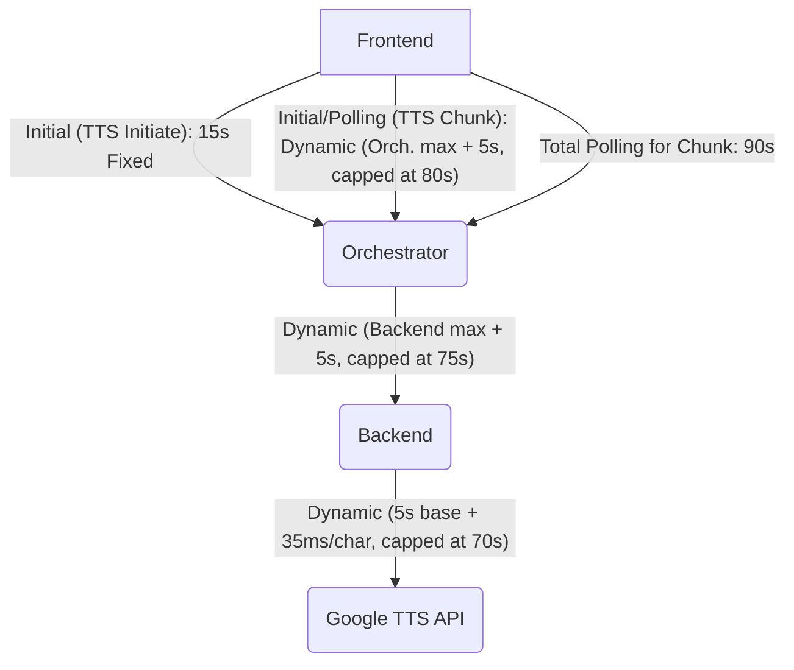

### Architectural Review Plan: Timeout Synchronization and API Contract Compatibility

**Objective:** To ensure proper communication and error handling, including timeout management and consistent API contracts, across the TTS system components: Frontend (`tts-frontend/index.html`), Orchestrator Worker (`orchestrator/src/index.mjs`), and Backend Src Worker (`src/handlers/tts.mjs`).

---

#### 1. Timeout Synchronization Analysis and Recommendations

**Acknowledgement of User Feedback and Core Challenge:**
Your measurement that `~1530 characters takes ~52 seconds` to generate audio, combined with the clarification on Cloudflare Worker CPU vs. Wall-Clock time, is critical. You've also requested to adjust the Google API timeout to 70 seconds for efficiency.

*   **CPU Time:** Consumed by active computation (e.g., JSON parsing, audio decoding, encryption). Limited to 10ms (Free Plan) or configurable up to 5 minutes (Paid Plan).
*   **Wall-Clock Time:** Total time a request takes, including waiting for external APIs. This is largely unlimited within the context of a single `fetch` operation if `event.waitUntil()` is properly used.
*   The 52-second latency from Google's API primarily impacts **wall-clock time**. CPU time is only consumed during the processing *after* the `fetch` resolves.
*   **Key implication:** Timeout errors are more likely to stem from clients disconnecting (e.g., frontend's 30s disconnect) or explicit `fetch` timeouts, rather than the backend worker exceeding its CPU limit *while waiting* for the external API. However, the post-processing *after* the API call *does* consume CPU time, which remains a constraint, especially on the free plan.

**Current State of Timeouts Across Components:**

*   **Frontend (`tts-frontend/index.html`):**
    *   **`/api/tts-initiate` & `/api/tts-chunk` (initial fetches):** No explicit `fetch` timeouts are set. These requests rely on the browser's default timeout, which can be excessively long and does not offer fine-grained control.
    *   **`/api/tts-chunk` (polling):** Explicitly defines `MAX_POLLING_TIME_MS = 30000` (30 seconds) for the overall polling duration for a single chunk. This is a client-side wall-clock timeout.
    *   **Unused Variables:** `SENTENCE_FETCH_TIMEOUT_MS` (15s) and `FIRST_SENTENCE_TIMEOUT_MS` (20s) are declared but not actively utilized in current `fetch` operations.

*   **Orchestrator Worker (`orchestrator/src/index.mjs`):**
    *   **Calls to Backend `/api/rawtts` (`_callBackendTtsService`):** No explicit `fetch` timeout is applied to the individual HTTP requests made to the backend worker. It relies on Cloudflare Worker's default `fetch` timeout. A retry mechanism (`maxRetries = 3` with exponential backoff) is implemented for transient errors. Crucially, `event.waitUntil()` should be used here to ensure the worker remains active during the potentially long backend processing time.
    *   **Polling Backend `/api/tts-result` (`_pollForTtsResult`):** Defines `POLLING_MAX_ATTEMPTS = 30` and `POLLING_BASE_DELAY_MS = 1000ms`, resulting in a total polling window of approximately 30 seconds. Individual polling `fetch` calls lack explicit timeouts. Again, `event.waitUntil()` is vital for each poll.

*   **Backend Src Worker (`src/handlers/tts.mjs`):**
    *   **Calls to Google Generative AI TTS API (`callGoogleTTSAPI`):** No explicit `fetch` timeout when making requests to the external Google API. While waiting for Google's API consumes **wall-clock time** (which `event.waitUntil()` can extend), the subsequent **JSON parsing and audio decoding** consume **CPU time**, which is strictly limited.

**Identified Discrepancies and Potential Issues (Revisited with Dynamic Context):**

1.  **Frontend Client Disconnects (Wall-Clock):** The frontend's current 30-second `MAX_POLLING_TIME_MS` is insufficient given the 52-second Google API latency for large chunks, leading to premature client-side disconnections.
2.  **Backend CPU Time for Post-Processing:** Although `fetch` waits don't consume CPU, the processing of the Google API response (JSON parsing, base64 decoding to PCM, WAV header generation) *does*. For very large chunks, this post-processing could exceed the 10ms (free plan) or even configurable CPU limits, leading to worker termination.
3.  **Lack of End-to-End Explicit Timeouts:** Despite the wall-clock nature of `fetch` waits, explicit timeouts are still crucial to prevent indefinite hangs if an upstream service never responds, and to provide clear feedback to the user.
4.  **`event.waitUntil()` Usage:** While implied, explicit confirmation and proper implementation of `event.waitUntil()` across Orchestrator and Backend workers are necessary to avoid worker termination during long `fetch` operations.
5.  **Redundant Frontend Variables:** The `SENTENCE_FETCH_TIMEOUT_MS` and `FIRST_SENTENCE_TIMEOUT_MS` variables in the frontend are declared but not used.

**Recommendations for Synchronizing Timeouts (with Dynamic Adjustments and Gaps):**

To establish a robust, synchronized, and logically aligned timeout strategy, I recommend implementing explicit dynamic timeouts using `AbortController` and `signal` for all critical `fetch` operations, with careful consideration of Cloudflare Worker limits and client-side expectations. Proper use of `event.waitUntil()` is assumed for all long-running `fetch` operations in workers.

*   **Backend Src Worker (`src/handlers/tts.mjs` - calls to Google Generative AI TTS API):**
    *   **Recommendation:** Implement a dynamic `fetch` timeout using `AbortController` and `signal` within `callGoogleTTSAPI`. This timeout is for the *external API call itself*.
    *   **Dynamic Calculation (Wall-Clock):** `timeoutMs = 5000 (base overhead) + (character_count * 35);` (milliseconds)
        *   This provides a base 5-second overhead (allowing for initial connection and Google's internal queuing) plus approximately 35ms per character (derived from your 52s/1530 chars measurement).
    *   **Explicit Cap:** This dynamic timeout **must be capped at 70 seconds (70000 ms)** as per your request.
    *   **CPU Time Consideration:** The post-processing (JSON parsing, audio decoding) after the Google API response *must* be optimized to fit within Cloudflare's CPU limits. For the free tier (10ms CPU), this is a severe constraint. For paid tiers, this can be configured. If large chunks lead to CPU overruns during this phase, further optimization (e.g., streaming processing, offloading to client-side WebAssembly, or using Cloudflare Queues for background processing) or a reduction in `MAX_TEXT_LENGTH_CHARACTER_COUNT` at the orchestrator level would be necessary.

*   **Orchestrator Worker (`orchestrator/src/index.mjs` - calls to Backend Src Worker):**
    *   **Recommendation:** Apply dynamic timeouts to individual `fetch` calls within `_callBackendTtsService` (to `/api/rawtts`) and `_pollForTtsResult` (to `/api/tts-result`).
    *   **Dynamic Calculation (Wall-Clock):** `timeoutMs = (Backend's Dynamic Timeout for the specific chunk) + 5000;` (Add 5 seconds buffer for network latency and orchestrator processing).
    *   **Explicit Cap:** This timeout will be capped at **75 seconds (75000 ms)** (70s backend cap + 5s buffer). This ensures the orchestrator doesn't wait longer than the backend is designed to respond.
    *   **Circuit Breakers:** Consider implementing circuit breakers for calls to the backend workers to gracefully handle repeated failures or slow responses, as suggested in your feedback.

*   **Frontend (`tts-frontend/index.html`):**
    *   **Recommendation (Initial `fetch` calls):**
        *   For `/api/tts-initiate` (POST): Introduce a fixed timeout of **15 seconds**. This request is for job initiation and metadata storage, which should be relatively quick.
        *   For initial `/api/tts-chunk` (GET): Introduce a dynamic timeout calculated as `(Orchestrator's Dynamic Timeout for the specific chunk) + 5000;` (Add 5 seconds buffer for network latency).
        *   **Explicit Cap:** This will be capped at **80 seconds (80000 ms)** (75s orchestrator cap + 5s buffer).
    *   **Recommendation (`MAX_POLLING_TIME_MS`):**
        *   The current `MAX_POLLING_TIME_MS = 30000` (30 seconds) for *total polling duration for a single chunk* is definitely insufficient.
        *   **Revised Recommendation:** Increase `MAX_POLLING_TIME_MS` to **90 seconds (90000 ms)**. This allows for sufficient time for a chunk to be processed (up to 70s at Google API + network/processing overhead) and for potential retries within the polling loop.
    *   **Cleanup:** Remove the unused `SENTENCE_FETCH_TIMEOUT_MS` and `FIRST_SENTENCE_TIMEOUT_MS` variables.

**Timeout Synchronization Flow (Conceptual with Dynamic Timings and Wall-Clock Focus):**

---

#### 2. API Contract Compatibility Analysis and Recommendations

**Review of API Contracts and Compatibility:**

*   **Frontend and Orchestrator:**
    *   **`/api/tts-initiate` (POST):**
        *   **Frontend Request:** Sends `{ fullText, voiceId, model, splittingPreference }`.
        *   **Orchestrator (`handleTtsInitiate`) Expectation:** Expects `{ fullText, voiceId, model, splittingPreference }`.
        *   **Compatibility:** **Compatible.**
        *   **Frontend Response Expectation:** Expects `{ jobId, totalChunks, chunkLengths }`.
        *   **Orchestrator Response (`handleTtsInitiate`):** Returns `{ jobId, totalChunks, expectedMimeType, chunkLengths }`.
        *   **Compatibility:** **Mostly Compatible.** `expectedMimeType` is returned by the orchestrator but not explicitly used by the frontend here, but it's not a breaking change.
    *   **`/api/tts-chunk` (GET):**
        *   **Frontend Request:** Sends `jobId` and `chunkIndex` as query parameters.
        *   **Orchestrator (`handleTtsChunk`) Expectation:** Expects `jobId` and `chunkIndex`.
        *   **Compatibility:** **Compatible.**
        *   **Frontend Response Expectation:** Expects a JSON object with `{ audioBase64, sentenceMapping }`.
        *   **Orchestrator Response (`handleTtsChunk`):** Currently returns a JSON object with `{ audioContentBase64, mimeType, index, status }`.
        *   **Compatibility:** **Incompatible (Critical).**
            *   **`audioBase64` vs `audioContentBase64`:** This is a naming inconsistency (`audioBase64` vs `audioContentBase64`) but the data is the same. The frontend uses `chunkData.audioBase64` but receives `audioContentBase64`. This needs to be resolved.
            *   **Missing `sentenceMapping`:** The frontend explicitly expects `sentenceMapping`, but the orchestrator does not provide it in the `/api/tts-chunk` response. This is a functional gap, as the backend's `callGoogleTTSAPI` also does not return this information.
        *   **HTTP Status Codes:** Frontend handles 200 (OK), 202 (Accepted/Polling), 410 (Gone/Permanent Failure), and generic errors. Orchestrator returns these statuses correctly.
*   **Orchestrator and Src Workers (Backend):**
    *   **`/api/rawtts` (POST, Orchestrator calls Backend):**
        *   **Orchestrator Request (`_callBackendTtsService`):** Sends JSON with `{ text, model, voiceId }`.
        *   **Backend (`handleRawTTS`) Expectation:** Expects `{ text, model }` in the request body, but `voiceName` (which corresponds to `voiceId` from Orchestrator) is expected as a *query parameter* (`url.searchParams.get('voiceName')`).
        *   **Compatibility:** **Incompatible.** The `voiceId`/`voiceName` parameter location is mismatched.
        *   **Orchestrator Response Expectation (200 OK):** Expects JSON with `{ audioContentBase64, mimeType }`.
        *   **Backend Response (`handleRawTTS` for immediate response):** Returns raw `audio/wav` binary data directly with `Content-Type: audio/wav`, not a JSON object.
        *   **Compatibility:** **Incompatible (Critical).** The data format (binary vs. JSON) is fundamentally different from what the orchestrator expects.
        *   **Orchestrator Response Expectation (202 Accepted):** Expects JSON with `{ jobId }` or `X-Processing-Job-Id` header.
        *   **Backend Response (`handleRawTTS` for async response):** Returns JSON with `{ jobId, status: 'processing' }` and `X-Processing-Job-Id` header.
        *   **Compatibility:** **Compatible.**
    *   **`/api/tts-result` (GET, Orchestrator polls Backend):**
        *   **Orchestrator Request (`_pollForTtsResult`):** Sends `jobId` as a query parameter.
        *   **Backend (`handleTtsResult`) Expectation:** Expects `jobId` as a query parameter.
        *   **Compatibility:** **Compatible.**
        *   **Orchestrator Response Expectation (200 OK):** Expects JSON with `{ base64Audio }`.
        *   **Backend Response (`handleTtsResult` for completed job):** Returns raw `audio/wav` binary data directly with `Content-Type: audio/wav`, not a JSON object.
        *   **Compatibility:** **Incompatible (Critical).** The data format (binary vs. JSON) is fundamentally different from what the orchestrator expects.
        *   **Orchestrator Response Expectation (202 Accepted):** Expects JSON with `{ jobId, status: 'processing' }`.
        *   **Backend Response (`handleTtsResult`):** Returns JSON with `{ jobId, status: 'processing' }`.
        *   **Compatibility:** **Compatible.**
        *   **Orchestrator Handling of 404:** Orchestrator correctly handles 404. Backend returns 404 if job not found/expired.

**Key API Contract Mismatches (Summary):**

1.  **`sentenceMapping` (Frontend <-> Orchestrator):** The frontend expects `sentenceMapping` in the `/api/tts-chunk` response, but neither the orchestrator nor the backend currently provides it.
2.  **`voiceId` vs `voiceName` Parameter Location (Orchestrator -> Backend `/api/rawtts`):** The orchestrator sends `voiceId` in the request body, while the backend expects `voiceName` in the query parameters.
3.  **Audio Data Format (Orchestrator <-> Backend `/api/rawtts` and `/api/tts-result`):** The orchestrator expects base64 encoded audio data within a JSON object, but the backend returns raw `audio/wav` binary data directly.

**Recommendations for API Contract Adjustments:**

To ensure seamless and compatible API communication, I recommend the following adjustments:

*   **For `sentenceMapping` (Frontend <-> Orchestrator):**
    *   **Recommendation:** The orchestrator (`orchestrator/src/index.mjs`) should perform sentence mapping *before* sending text to the backend for TTS. It should store this mapping alongside the job metadata in the Durable Object. When responding to `/api/tts-chunk` requests, the orchestrator should retrieve and include the relevant `sentenceMapping` in its JSON response. This aligns with the frontend's current expectation and allows for accurate word highlighting.
    *   Alternatively (less preferred): If server-side `sentenceMapping` is unfeasible, the frontend would need to be modified to perform sentence mapping client-side for highlighting or to remove the highlighting feature.

*   **For `voiceId` vs `voiceName` Parameter Location (Orchestrator -> Backend `/api/rawtts`):**
    *   **Recommendation:** Standardize the parameter name and location. Modify the backend (`src/handlers/tts.mjs`) to expect `voiceId` (or `voiceName` if that's the preferred term) in the *request body*, consistent with how the orchestrator sends it. This avoids mixing query parameters and body parameters for core data.

*   **For Audio Data Format (Orchestrator <-> Backend `/api/rawtts` and `/api/tts-result`):**
    *   **Recommendation:** Modify the backend (`src/handlers/tts.mjs`) to base64 encode the generated audio data and return it within a JSON object, along with the `mimeType`, for both successful (`200 OK`) responses from `/api/rawtts` and `/api/tts-result`. This will align the backend's responses with the orchestrator's current expectation for JSON-encoded audio data, simplifying data handling in the orchestrator.

---

#### 3. Orchestrator's Robustness Confirmation

The orchestrator's expectation of the backend (`/api/rawtts` returning 200/202 and `/api/tts-result` for polling) is **conceptually robustly handled** in terms of its state machine and retry/polling logic. It correctly transitions between states (e.g., from immediate success to polling for async jobs) and manages retries for transient errors.

**However, for true robustness, the following critical issues must be addressed based on the refined understanding:**
1.  **Fundamental Data Format Mismatch:** The orchestrator's code is written to parse JSON responses containing base64 audio, but the backend currently returns raw WAV binary data. This means that while the orchestrator's flow logic is sound, it will fail to correctly process the audio data due to a type mismatch unless the backend's response format is adjusted as recommended.
2.  **Cloudflare Worker CPU Limit for Post-Processing:** While waiting for external APIs doesn't consume CPU time, the subsequent processing of the response (e.g., JSON parsing, audio decoding) *does*. For free-tier Cloudflare Workers (10ms CPU limit), this is a significant constraint. If processing large audio chunks causes CPU overruns after the Google API call, then either:
    *   The `MAX_TEXT_LENGTH_CHARACTER_COUNT` in the orchestrator needs to be reduced to ensure post-processing fits within CPU limits.
    *   A more advanced asynchronous processing model (e.g., using Cloudflare Queues for background processing, or streaming audio directly to client from backend via Durable Object) would be required.
3.  **`event.waitUntil()` Usage:** Proper and consistent use of `event.waitUntil()` in both the Orchestrator and Backend workers is essential to ensure that worker execution is not terminated prematurely while waiting for long-running `fetch` operations to complete.