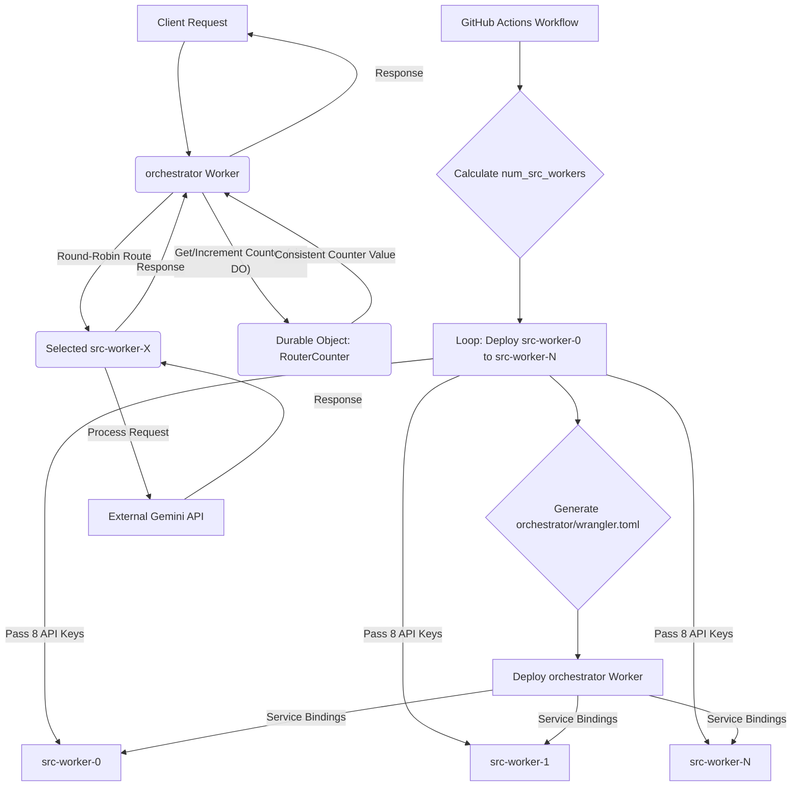
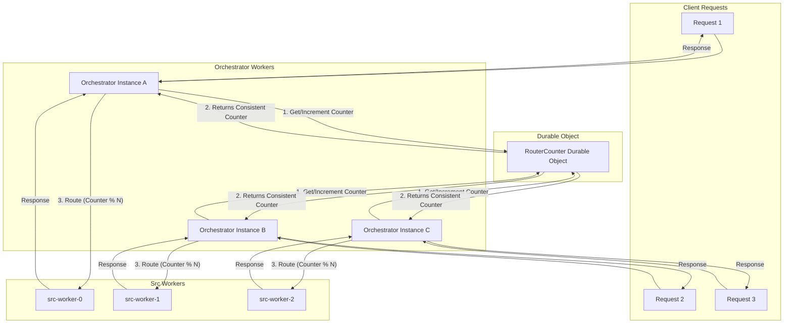

# Feature Document: Dynamic `src` Worker Deployment with Consistent Round-Robin Routing

**Overall Goal:** To dynamically deploy `src` workers based on the total number of available API keys (one `src` worker per 8 keys), and enable the `orchestrator` worker to route incoming requests to these `src` workers in a consistent round-robin fashion. Each `src` worker will be responsible for its assigned subset of 8 API keys.

**Assumptions:**

*   API keys are named `KEY1`, `KEY2`, ..., `KEYN` and are stored as GitHub Secrets.
*   The CI/CD pipeline (`.github/workflows/cf-deploy.yml`) is capable of reading all `KEY` secrets.
*   The `src` worker (`src/worker.mjs`) is designed to use API keys provided via its environment variables.

**High-Level Architecture:**

The system consists of:
1.  A CI/CD pipeline (`.github/workflows/cf-deploy.yml`) that dynamically calculates the number of `src` workers needed, deploys each `src` worker with a unique name and its assigned 8 API keys, and then generates and deploys the `orchestrator` worker with service bindings to all deployed `src` workers.
2.  An `orchestrator` worker that uses a Cloudflare Durable Object to maintain a global, consistent round-robin counter and dynamically routes incoming requests to the next available `src` worker via service bindings.
3.  Multiple `src` workers, each handling requests for its specific set of 8 API keys.

---

### Why a Durable Object for Round-Robin Consistency?

The Durable Object is crucial in this architecture to ensure **consistent round-robin routing** across potentially many instances of the `orchestrator` worker.

Here's why it's needed:

1.  **The Problem of Distributed State:** Cloudflare Workers are stateless by design. If each `orchestrator` worker instance were to maintain its own counter for round-robin routing, then:
    *   Each new request could hit a different `orchestrator` instance.
    *   Each instance would have its own independent counter, leading to requests being routed inconsistently or unevenly to the `src` workers. For example, `orchestrator-instance-A` might route to `src-worker-0`, and then `orchestrator-instance-B` (which has its own counter starting from 0) might also route to `src-worker-0`, defeating the round-robin purpose.

2.  **Durable Objects as a Solution for Global State:** Cloudflare Durable Objects provide a way to maintain a single, consistent instance of a class that can hold state across multiple requests and even across different worker instances. They are essentially singletons that can be accessed by name from any worker.

3.  **How `RouterCounter` Uses a Durable Object:**
    *   The `RouterCounter` Durable Object is designed to be a centralized, globally consistent counter.
    *   When an `orchestrator` worker receives a request, it doesn't increment a local counter. Instead, it interacts with the `RouterCounter` Durable Object (specifically, it calls the `/increment` endpoint on the Durable Object).
    *   The Durable Object's `fetch` method increments its *own* internal counter (which is persisted) and returns the new value.
    *   Since there's only one logical instance of the `RouterCounter` Durable Object (identified by a unique name like "global-router-counter"), all `orchestrator` workers will always get the next sequential counter value from this single source.
    *   This ensures that `src` workers are selected in a truly consistent round-robin fashion, regardless of which `orchestrator` instance handles a particular request.

In essence, the Durable Object acts as a single source of truth for the round-robin state, preventing race conditions and ensuring predictable, even distribution of requests among the `src` workers.

---

### Implemented Features

This section outlines the key features that have been implemented to achieve dynamic `src` worker deployment and consistent round-robin routing.

**I. CI/CD Pipeline Enhancements (`.github/workflows/cf-deploy.yml`)**

The CI/CD pipeline has been significantly enhanced to automate the deployment and management of `src` workers and the `orchestrator`.

1.  **Dynamic API Key Collection:** The pipeline now includes a step that efficiently collects all available `KEY` secrets from GitHub and outputs them in a structured format, along with a total count. This enables subsequent steps to dynamically determine the number of `src` workers needed.
2.  **Dynamic `src` Worker Deployment:** A new loop has been introduced in the deployment job. This loop iterates through the collected API keys, groups them into sets of 8, and deploys a unique `src` worker for each set. Each `src` worker receives its specific subset of API keys as environment variables, ensuring it operates with its assigned keys.
3.  **Dynamic `orchestrator` `wrangler.toml` Generation:** A dedicated step now dynamically generates the `orchestrator/wrangler.toml` file. This generated configuration includes all necessary service bindings to the newly deployed `src` workers, as well as the binding for the `RouterCounter` Durable Object. This ensures the `orchestrator` is correctly configured to interact with its backend workers.
4.  **Preview Environment Cleanup:** The `cleanup_preview` job has been updated to automatically delete all dynamically deployed `src` workers and their associated `orchestrator` bindings when a pull request is closed. This ensures efficient resource management and prevents orphaned deployments.

**II. `orchestrator` Worker Functionality**

The `orchestrator` worker has been updated to manage the round-robin state and dynamically select the correct `src` worker.

1.  **Durable Object Integration for Round-Robin Counter:** The `orchestrator` now utilizes a `RouterCounter` Durable Object. This Durable Object maintains a single, globally consistent counter, ensuring that all `orchestrator` instances contribute to a unified round-robin sequence for routing requests.
2.  **Dynamic Service Binding Discovery:** The `orchestrator`'s `fetch` function dynamically discovers all `BACKEND_SERVICE_N` bindings from its environment. This allows the `orchestrator` to adapt to the varying number of `src` workers deployed by the CI/CD pipeline without requiring manual configuration updates.
3.  **Round-Robin Routing Logic:** The core routing logic in the `orchestrator` has been implemented to leverage the `RouterCounter` Durable Object. It fetches the current counter, calculates the target `src` worker index using the modulo operator, and forwards the incoming request to the selected `src` worker.

**III. `src` Worker Adaptations**

The `src` worker has been adapted to seamlessly integrate with the dynamic deployment and routing mechanism.

1.  **Dynamic API Key Handling:** The `getRandomApiKey` function within the `src` worker has been verified to correctly handle API keys passed to its environment. It dynamically identifies and utilizes only the specific set of API keys assigned to that worker instance, rather than attempting to access a global range.

**IV. Key Considerations**

1.  **API Key Security:** API keys are securely stored as GitHub Secrets and are never hardcoded or exposed in logs, adhering to best security practices.
2.  **Error Handling:** Robust error handling is implemented in the `orchestrator`. If a request forwarding to a `src` worker fails, the error is logged, and a graceful error response is returned to the client, enhancing system resilience.
3.  **Observability:** Comprehensive logging has been set up for both the `orchestrator` and individual `src` workers. This includes tracking routing decisions, `RouterCounter` values, and error occurrences, providing essential insights for monitoring and debugging.
4.  **Deployment Complexity:** The dynamic deployment introduces significant complexity to the CI/CD pipeline, which has been thoroughly tested to ensure reliability.
5.  **Cost Implications:** Each `src` worker deployment is a separate Cloudflare Worker instance, incurring its own costs. This has been considered in the architectural design.
6.  **Durable Object Consistency:** The Durable Object ensures a single, consistent counter for round-robin routing, mitigating issues related to distributed state. Its billing model and potential cold start latency for initial requests have been acknowledged.