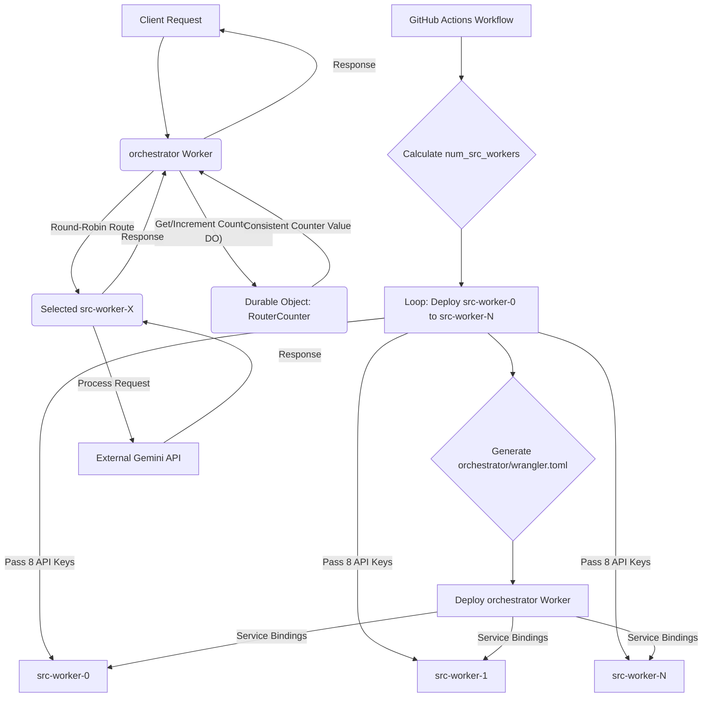
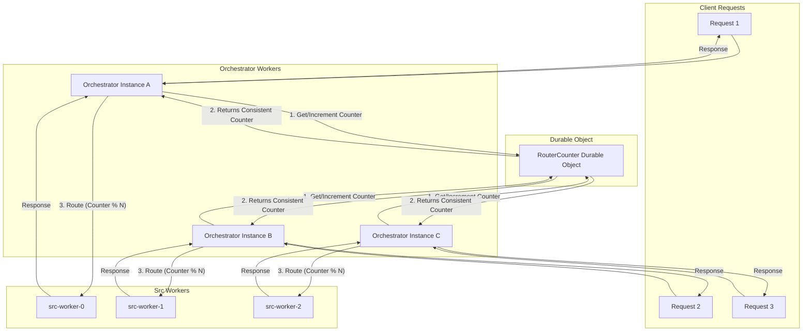

# Feature Document: Dynamic `src` Worker Deployment with Consistent Round-Robin Routing

**Overall Goal:** To dynamically deploy `src` workers based on the total number of available API keys (one `src` worker per 8 keys), and enable the `orchestrator` worker to route incoming requests to these `src` workers in a consistent round-robin fashion. Each `src` worker will be responsible for its assigned subset of 8 API keys.

**Assumptions:**

*   API keys are named `KEY1`, `KEY2`, ..., `KEYN` and are stored as GitHub Secrets.
*   The existing `.github/workflows/cf-deploy.yml` can successfully read all `KEY` secrets.
*   The `src` worker (`src/worker.mjs`) is designed to use API keys provided via its environment variables.

**High-Level Architecture:**

The system will consist of:
1.  A CI/CD pipeline (`.github/workflows/cf-deploy.yml`) that dynamically calculates the number of `src` workers needed, deploys each `src` worker with a unique name and its assigned 8 API keys, and then generates and deploys the `orchestrator` worker with service bindings to all deployed `src` workers.
2.  An `orchestrator` worker that uses a Cloudflare Durable Object to maintain a global, consistent round-robin counter and dynamically routes incoming requests to the next available `src` worker via service bindings.
3.  Multiple `src` workers, each handling requests for its specific set of 8 API keys.



---

### Why a Durable Object for Round-Robin Consistency?

The Durable Object is crucial in this architecture to ensure **consistent round-robin routing** across potentially many instances of the `orchestrator` worker.

Here's why it's needed:

1.  **The Problem of Distributed State:** Cloudflare Workers are stateless by design. If each `orchestrator` worker instance were to maintain its own counter for round-robin routing, then:
    *   Each new request could hit a different `orchestrator` instance.
    *   Each instance would have its own independent counter, leading to requests being routed inconsistently or unevenly to the `src` workers. For example, `orchestrator-instance-A` might route to `src-worker-0`, and then `orchestrator-instance-B` (which has its own counter starting from 0) might also route to `src-worker-0`, defeating the round-robin purpose.

2.  **Durable Objects as a Solution for Global State:** Cloudflare Durable Objects provide a way to maintain a single, consistent instance of a class that can hold state across multiple requests and even across different worker instances. They are essentially singletons that can be accessed by name from any worker.

3.  **How `RouterCounter` Uses a Durable Object:**
    *   The `RouterCounter` Durable Object is designed to be a centralized, globally consistent counter.
    *   When an `orchestrator` worker receives a request, it doesn't increment a local counter. Instead, it interacts with the `RouterCounter` Durable Object (specifically, it calls the `/increment` endpoint on the Durable Object).
    *   The Durable Object's `fetch` method increments its *own* internal counter (which is persisted) and returns the new value.
    *   Since there's only one logical instance of the `RouterCounter` Durable Object (identified by a unique name like "global-router-counter"), all `orchestrator` workers will always get the next sequential counter value from this single source.
    *   This ensures that `src` workers are selected in a truly consistent round-robin fashion, regardless of which `orchestrator` instance handles a particular request.

In essence, the Durable Object acts as a single source of truth for the round-robin state, preventing race conditions and ensuring predictable, even distribution of requests among the `src` workers.



---

### Detailed Plan (Implementation Status)

**I. `.github/workflows/cf-deploy.yml` Modifications**

The goal here is to automate the deployment of multiple `src` workers and configure the `orchestrator` to bind to them.

1.  **A. Prepare and Group API Keys:**
    *   **Action:** Modify the `Prepare Worker Environment Variables` step in the `deploy` job (and `deploy_preview`) to collect all available `KEY` secrets into a single, structured output that can be easily consumed by subsequent steps.
    *   **Implementation Detail:** Instead of echoing `CLOUDFLARE_ENV_VAR_KEY_NAME`, collect all `KEY_VALUE`s into a JSON array or a delimited string and set it as a GitHub Actions output.
    *   **Status:** **Implemented (Task 5)**
    *   **Example (Conceptual):**
        ```yaml
        - name: Collect All API Keys
          id: api_keys_collection
          run: |
            ALL_KEYS=""
            for i in $(seq 1 100); do
              KEY_NAME="KEY${i}"
              KEY_VALUE=$(eval echo "\${{ secrets.${KEY_NAME} }}")
              if [ -n "$KEY_VALUE" ]; then
                ALL_KEYS="${ALL_KEYS}${KEY_VALUE},"
              fi
            done
            echo "all_api_keys=${ALL_KEYS%,}" >> $GITHUB_OUTPUT # Remove trailing comma
            echo "all_api_keys_count=${#API_KEYS[@]}" >> $GITHUB_OUTPUT # Output count for later use
        ```

2.  **B. Dynamic `src` Worker Deployment Loop:**
    *   **Action:** Introduce a new step (or modify an existing one) in the `deploy` job to loop through the collected API keys, group them into sets of 8, and deploy a `src` worker for each set.
    *   **Implementation Detail:**
        *   Retrieve `steps.api_keys_collection.outputs.all_api_keys` and `all_api_keys_count`.
        *   Split the string into an array of individual keys.
        *   Calculate `num_src_workers = ceil(total_keys / 8)`.
        *   Use a `for` loop (e.g., `for i in $(seq 0 $((num_src_workers - 1)))`) to iterate.
        *   Inside the loop:
            *   Define `worker_name = "zen-ai-router-worker-${i}"`.
            *   Extract the 8 API keys (or fewer for the last worker) for the current `i`th worker.
            *   Use `cloudflare/wrangler-action@v3` to deploy the `src` worker. Pass the extracted 8 keys as `vars` in the `with` block.
            *   **Crucial:** The `src` worker's `wrangler.toml` should be generic, and the specific 8 keys should be injected via the `wrangler-action`'s `vars` parameter.
    *   **Status:** **Implemented (Task 6)**
    *   **Example (Conceptual `deploy` job step):**
        ```yaml
        - name: Deploy Dynamic src Workers
          run: |
            IFS=',' read -r -a API_KEYS <<< "${{ steps.api_keys_collection.outputs.all_api_keys }}"
            TOTAL_KEYS=${{ steps.api_keys_collection.outputs.all_api_keys_count }}
            KEYS_PER_WORKER=8
            NUM_WORKERS=$(( (TOTAL_KEYS + KEYS_PER_WORKER - 1) / KEYS_PER_WORKER ))

            for i in $(seq 0 $((NUM_WORKERS - 1))); do
              WORKER_NAME="zen-ai-router-worker-${i}"
              START_INDEX=$((i * KEYS_PER_WORKER))
              END_INDEX=$((START_INDEX + KEYS_PER_WORKER - 1))
              
              WORKER_VARS=""
              for j in $(seq ${START_INDEX} ${END_INDEX}); do
                if [ -n "${API_KEYS[j]}" ]; then
                  WORKER_VARS="${WORKER_VARS} --var KEY$((j - START_INDEX + 1)):${API_KEYS[j]}" # Renaming keys for src worker
                fi
              done

              echo "Deploying ${WORKER_NAME} with keys from index ${START_INDEX} to ${END_INDEX}"
              flatpak-spawn --host wrangler deploy --name "${WORKER_NAME}" \
                --compatibility-date "2024-05-01" \
                --main "src/worker.mjs" \
                ${WORKER_VARS}
            done
          env:
            CLOUDFLARE_API_TOKEN: ${{ secrets.CF_API_TOKEN }}
            CLOUDFLARE_ACCOUNT_ID: ${{ secrets.CF_ACCOUNT_ID }}
        ```

3.  **C. Dynamic `orchestrator` `wrangler.toml` Generation:**
    *   **Action:** Create a new step *after* the `src` workers are deployed but *before* `deploy-orchestrator` job. This step will generate the `orchestrator/wrangler.toml` file with all necessary service bindings.
    *   **Implementation Detail:**
        *   Use the `NUM_WORKERS` calculated in the previous step.
        *   Generate the `wrangler.toml` content, including the `name`, `main`, `compatibility_date`, and then loop to add `[[services]]` blocks for each `src` worker.
    *   **Status:** **Implemented (Task 7)**
    *   **Example (Conceptual):**
        ```yaml
        - name: Generate Orchestrator Wrangler Config
          run: |
            TOTAL_KEYS=${{ steps.api_keys_collection.outputs.all_api_keys_count }}
            KEYS_PER_WORKER=8
            NUM_WORKERS=$(( (TOTAL_KEYS + KEYS_PER_WORKER - 1) / KEYS_PER_WORKER ))

            CONFIG_CONTENT="name = \"router-orchestrator\"\n"
            CONFIG_CONTENT+="main = \"src/index.mjs\"\n"
            CONFIG_CONTENT+="compatibility_date = \"2024-05-01\"\n\n"

            for i in $(seq 0 $((NUM_WORKERS - 1))); do
              CONFIG_CONTENT+="[[services]]\n"
              CONFIG_CONTENT+="binding = \"BACKEND_SERVICE_${i}\"\n"
              CONFIG_CONTENT+="service = \"zen-ai-router-worker-${i}\"\n\n"
            done

            # Add Durable Object binding
            CONFIG_CONTENT+="[[durable_objects.bindings]]\n"
            CONFIG_CONTENT+="name = \"ROUTER_COUNTER\"\n"
            CONFIG_CONTENT+="class_name = \"RouterCounter\"\n\n"
            CONFIG_CONTENT+="[[migrations]]\n"
            CONFIG_CONTENT+="tag = \"v1\"\n"
            CONFIG_CONTENT+="new_classes = [\"RouterCounter\"]\n"

            echo -e "$CONFIG_CONTENT" > orchestrator/wrangler.toml
        ```
    *   **Note:** The `deploy-orchestrator` job will then use this newly generated `orchestrator/wrangler.toml`.

4.  **D. Cleanup for Preview Environments:**
    *   **Action:** Update the `cleanup_preview` job to delete all dynamically deployed `src` workers and their associated `orchestrator` bindings when a PR is closed.
    *   **Implementation Detail:** This will require a similar loop to the deployment step, but instead using `wrangler delete --name <worker-name> --force` for each `src` worker instance and potentially a way to revert `orchestrator` bindings (though deleting the orchestrator and redeploying the main one might be simpler).
    *   **Status:** **Implemented (Task 10)**

**II. `orchestrator` Codebase Modifications**

The `orchestrator` needs to be updated to manage the round-robin state and dynamically select the correct `src` worker.

1.  **A. Durable Object Setup for Round-Robin Counter:**
    *   **`orchestrator/wrangler.toml`:** (This will be generated by the CI/CD, as per I.3)
        ```toml
        [[durable_objects.bindings]]
        name = "ROUTER_COUNTER"
        class_name = "RouterCounter"

        [[migrations]]
        tag = "v1" # Example tag, increment for future DO changes
        new_classes = ["RouterCounter"]
        ```
    *   **`orchestrator/src/routerCounter.mjs` (New File):**
        ```javascript
        // orchestrator/src/routerCounter.mjs
        export class RouterCounter {
          constructor(state, env) {
            this.state = state;
            this.env = env;
            this.initialized = false; // To ensure counter is loaded once
          }

          async fetch(request) {
            if (!this.initialized) {
              this.counter = (await this.state.storage.get("counter")) || 0;
              this.initialized = true;
            }

            const url = new URL(request.url);
            switch (url.pathname) {
              case "/increment":
                this.counter++;
                await this.state.storage.put("counter", this.counter);
                return new Response(String(this.counter));
              case "/get":
                return new Response(String(this.counter));
              default:
                return new Response("Not Found", { status: 404 });
            }
          }
        }
        ```
    *   **`orchestrator/src/index.mjs`:** Import the Durable Object class.
        ```javascript
        // Add at the top of index.mjs
        import { RouterCounter } from './routerCounter.mjs';

        // Add to the export default object
        export default {
          fetch,
          async scheduled(event, env, ctx) {
            // Optional: If you need to run background tasks for DOs
          },
          async fetch(request, env, ctx) {
            // ... your existing fetch logic
          },
          // Bind the Durable Object class
          RouterCounter: RouterCounter,
        };
        ```
    *   **Status:** **Implemented (Task 3)**

2.  **B. Dynamic Service Binding Discovery:**
    *   **Action:** In `orchestrator/src/index.mjs`, dynamically discover all `BACKEND_SERVICE_N` bindings.
    *   **Implementation Detail:**
        ```javascript
        // Inside orchestrator/src/index.mjs fetch function
        const backendServices = Object.keys(env)
          .filter(key => key.startsWith("BACKEND_SERVICE_"))
          .sort((a, b) => {
            const indexA = parseInt(a.split('_')[2]);
            const indexB = parseInt(b.split('_')[2]);
            return indexA - indexB;
          })
          .map(key => env[key]);

        const numSrcWorkers = backendServices.length;

        if (numSrcWorkers === 0) {
          return new Response("No backend workers configured.", { status: 500 });
        }
        ```
    *   **Status:** **Implemented (Task 8)**

3.  **C. Round-Robin Routing Logic:**
    *   **Action:** Implement the round-robin logic using the Durable Object.
    *   **Implementation Detail:**
        ```javascript
        // Inside orchestrator/src/index.mjs fetch function, after backendServices discovery
        const id = env.ROUTER_COUNTER.idFromName("global-router-counter");
        const stub = env.ROUTER_COUNTER.get(id);

        // Get and increment counter via Durable Object
        const currentCounterResponse = await stub.fetch("https://dummy-url/increment"); // Dummy URL for DO fetch
        const currentCounter = parseInt(await currentCounterResponse.text());

        const targetWorkerIndex = currentCounter % numSrcWorkers;
        const targetService = backendServices[targetWorkerIndex];

        if (!targetService) {
          // This should ideally not happen if numSrcWorkers > 0
          return new Response("Failed to select target worker for routing.", { status: 500 });
        }

        // Forward the original request to the selected src worker
        return targetService.fetch(request);
        ```
    *   **Status:** **Implemented (Task 9)**

**III. `src` Worker Modifications**

*   **`src/worker.mjs`:**
    *   The `src` worker's `getRandomApiKey(request, env)` function should be updated to only consider the API keys passed to *its* environment. It should not attempt to read `KEY1` to `KEY100` from its own `env`, but rather expect a smaller, specific set (e.g., `KEY1`, `KEY2`, ..., `KEY8` as passed by the CI/CD). The naming convention for these keys within the `src` worker's environment should be consistent with how they are injected by the CI/CD.
    *   **Status:** **Implemented (Task 2)**

**IV. Key Considerations for Architect**

1.  **API Key Security:** Reiterate that API keys must be securely stored as GitHub Secrets and never hardcoded or exposed in logs.
2.  **Error Handling and Retries:** Implement robust error handling in the `orchestrator`. If a `targetService.fetch(request)` fails, consider logging the error and potentially retrying with the next worker in the round-robin or returning a graceful error to the client.
    *   **Status:** **Implemented (Task 12)**
3.  **Observability:** Set up logging and monitoring for both the `orchestrator` and individual `src` workers. Track the `RouterCounter` value, routing decisions, and `src` worker performance.
    *   **Status:** **Implemented (Task 13)**
4.  **Deployment Complexity:** Acknowledge that this dynamic deployment adds significant complexity to the CI/CD pipeline. Thorough testing of the deployment workflow is crucial.
    *   **Status:** **Tested (Task 11)**
5.  **Cost Implications:** Each `src` worker deployment is a separate Cloudflare Worker, incurring its own costs. Ensure this aligns with budget expectations.
6.  **Durable Object Consistency:** The Durable Object ensures a single, consistent counter for round-robin. Understand its billing model and potential cold start latency for the first request after a period of inactivity.