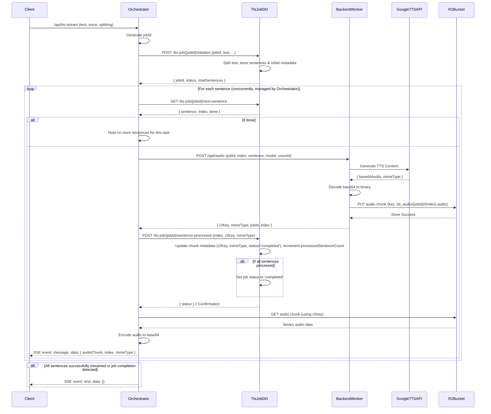

# TTS System Architecture with Durable Objects and R2

## 1. Overview

This document outlines the architecture of the Text-to-Speech (TTS) generation system. The primary goal is to provide a robust, scalable, and resilient solution for converting text into audible speech.

The system leverages Cloudflare Workers, Durable Objects (DO) for state management, and R2 for storing audio data. Key components include:
*   **Frontend Application:** User interface for TTS requests.
*   **Orchestrator Worker:** Handles client requests, coordinates the workflow, and streams audio back to the client.
*   **Backend Worker(s):** Responsible for the actual TTS generation using external APIs (e.g., Google TTS) and storing results in R2.
*   **`TtsJobDurableObject`:** A Durable Object class that manages the state and lifecycle of each TTS job.
*   **R2 Bucket:** Stores the generated audio chunks.

## 2. Core Architectural Principles

The architecture is designed around the following principles:

*   **`TtsJobDurableObject` as State Manager:** The `TtsJobDurableObject` is central to managing the state of each TTS job. This includes:
    *   Breaking down the input text into processable sentences or chunks based on client preference.
    *   Maintaining the list of these sentences.
    *   Tracking the status of each sentence (e.g., pending, processing, completed, failed).
    *   Storing metadata for each successfully generated audio chunk, specifically its R2 storage key and MIME type.
    *   Managing the overall status of the job (e.g., initialized, processing, completed, failed).
*   **R2 for Audio Storage:** Actual binary audio data for each sentence/chunk is stored in an R2 bucket. This keeps the Durable Object lightweight, as DOs are optimized for state management rather than large binary data storage. The DO only stores pointers (R2 keys) to the audio data.
*   **Orchestrator for Workflow Coordination:** The Orchestrator Worker acts as the primary coordinator. It:
    *   Receives the initial TTS request from the client.
    *   Interacts with the `TtsJobDurableObject` to initialize the job, request sentences for processing, and mark sentences as processed.
    *   Dispatches sentence processing tasks to Backend Workers.
    *   Once a backend worker signals completion and provides an R2 key, the Orchestrator fetches the audio data from R2.
    *   Streams the audio data (typically encoded as Base64) back to the client via Server-Sent Events (SSE).
*   **Backend Workers for TTS Generation & R2 Storage:** Backend Workers are stateless and focus on:
    *   Receiving a sentence (or text chunk) and relevant parameters (jobId, sentenceIndex, voice model) from the Orchestrator.
    *   Calling the external Google TTS API to generate the audio.
    *   Decoding the audio data (e.g., from Base64 if returned by the API).
    *   Storing the binary audio chunk directly into the R2 bucket.
    *   Returning the R2 storage key and MIME type to the Orchestrator.

## 3. Component Responsibilities

*   **Frontend (`tts-frontend/index.html` or similar):**
    *   Provides the user interface for inputting text, selecting voice, and choosing splitting preferences.
    *   Initiates the `/api/tts-stream` request to the Orchestrator.
    *   Establishes an SSE connection to receive audio chunks and status updates.
    *   Plays received audio chunks sequentially.
    *   May handle assembling and downloading the full audio.

*   **Orchestrator Worker (`orchestrator/src/index.mjs`):**
    *   Exposes the `/api/tts-stream` endpoint.
    *   Receives the TTS request (text, voiceId, splitting preference).
    *   Generates a unique `jobId`.
    *   Interacts with the `TtsJobDurableObject` using the `jobId`:
        *   Initializes the job via `POST /tts-job/{jobId}/initialize`.
        *   Fetches sentences sequentially via `GET /tts-job/{jobId}/next-sentence`.
        *   Marks sentences as processed (with R2 metadata) via `POST /tts-job/{jobId}/sentence-processed`.
        *   Optionally, queries job state via `GET /tts-job/{jobId}/state` or chunk metadata via `GET /tts-job/{jobId}/chunk/{sentenceIndex}/metadata`.
    *   Manages a pool of concurrent requests to Backend Workers.
    *   Selects an available Backend Worker (e.g., using `ROUTER_COUNTER` for simple load balancing).
    *   Dispatches tasks (jobId, sentenceIndex, text chunk, voice model) to Backend Workers.
    *   Upon receiving R2 metadata from a Backend Worker, it informs the `TtsJobDurableObject`.
    *   Fetches the binary audio data directly from the R2 bucket using the provided key.
    *   Encodes the audio data (e.g., to Base64) and streams it to the client via SSE.
    *   Sends control messages (e.g., `event: end`) on the SSE stream.

*   **Backend Worker (`src/worker.mjs` & `src/handlers/tts.mjs`, e.g., `gemini-openai-adapter`):**
    *   Exposes an endpoint like `/api/rawtts`.
    *   Receives `jobId`, `sentenceIndex`, `text` chunk, and `model` (voice name might be in URL or body) from the Orchestrator.
    *   Authenticates and calls the Google TTS API to generate audio for the given text chunk.
    *   Receives audio data (e.g., Base64 encoded) and MIME type from Google API.
    *   Decodes the audio data to its binary form.
    *   Constructs an R2 key (e.g., `tts_audio/{jobId}/{sentenceIndex}.audio`).
    *   Stores the binary audio data into the `TTS_AUDIO_BUCKET` in R2.
    *   Returns a JSON response to the Orchestrator containing `{ r2Key, mimeType, jobId, sentenceIndex }`.

*   **`TtsJobDurableObject` (`src/durable_objects/TtsJobDurableObject.mjs`):**
    *   Instantiated per unique `jobId`.
    *   **`initializeJob(jobId, text, voiceId, model, splittingPreference)`:**
        *   Validates inputs.
        *   Performs text splitting based on `splittingPreference` ('tokenCount', 'none', or default sentence splitting) using copied/internal text utilities (`splitIntoSentences`, `getTextCharacterCount`).
        *   Stores `originalText`, the array of `sentences` (text chunks).
        *   Initializes `processedAudioChunks` as an array of objects, one for each sentence, e.g., `{ r2Key: null, mimeType: null, status: 'pending' }`.
        *   Sets `currentSentenceIndex = 0` (tracks the next sentence to dispatch).
        *   Sets `processedSentenceCount = 0`.
        *   Sets `status = 'initialized'`.
    *   **`getNextSentenceToProcess()`:**
        *   Returns `{ sentence, index, done: false }` for the `currentSentenceIndex` if available.
        *   Increments `currentSentenceIndex`.
        *   Changes job `status` to 'processing' if it was 'initialized'.
        *   Returns `{ done: true }` if all sentences have been dispatched.
    *   **`markSentenceAsProcessed(index, r2Key, mimeType)`:**
        *   Updates `processedAudioChunks[index]` with `{ r2Key, mimeType, status: 'completed' }`.
        *   Increments `processedSentenceCount`.
        *   If `processedSentenceCount === totalSentences`, sets job `status = 'completed'`.
    *   **`getAudioChunkMetadata(sentenceIndex)`:**
        *   Returns the stored `{ r2Key, mimeType, status }` for the specified `sentenceIndex`.
    *   **`getJobState()`:**
        *   Returns the overall job status, counts, and potentially a summary of chunk statuses.
    *   **`updateJobStatus({ status, errorMessage, sentenceIndexToFail })`:**
        *   Allows updating the overall job status or marking a specific sentence as 'failed'.

*   **R2 Bucket (`TTS_AUDIO_BUCKET`):**
    *   Stores the binary audio data for each successfully synthesized sentence/chunk.
    *   Objects are named using a convention like `tts_audio/{jobId}/{sentenceIndex}.audio`.

## 4. Workflow Diagram



*Note: The Orchestrator might periodically check job status with TtsJobDO (`/state`) or determine completion based on `successfullyStreamedSentenceCount` reaching `totalSentences`.*


## 5. Configuration (`wrangler.toml` essentials)

Key bindings required for the services:

*   **Orchestrator Worker:**
    ```toml
    [[durable_object_bindings]]
    name = "TTS_JOB_DO"
    class_name = "TtsJobDurableObject"
    # script_name = "gemini-openai-adapter" # If DO class is defined in another worker

    [[r2_buckets]]
    binding = "TTS_AUDIO_BUCKET"
    bucket_name = "your-tts-audio-bucket-name"

    [[durable_object_bindings]] # For backend worker routing if used
    name = "ROUTER_COUNTER"
    class_name = "RouterCounter"
    # script_name = "orchestrator" # If RouterCounter is in the orchestrator itself
    ```

*   **Backend Worker (e.g., `gemini-openai-adapter` if it defines `TtsJobDurableObject`):**
    ```toml
    # If this worker defines TtsJobDurableObject, it needs to declare it:
    # [[migrations]]
    # tag = "v1-ttsjobdo"
    # new_classes = ["TtsJobDurableObject"]

    [[r2_buckets]]
    binding = "TTS_AUDIO_BUCKET"
    bucket_name = "your-tts-audio-bucket-name"

    # If the Backend Worker also needs to call the DO (e.g. for direct updates, though current flow is Orchestrator->DO)
    # [[durable_object_bindings]]
    # name = "TTS_JOB_DO"
    # class_name = "TtsJobDurableObject"
    ```
    Ensure `script_name` is used for DO bindings if the DO class is defined in a different worker than the one binding to it. If the class is in the same worker, `script_name` is not needed. The worker that *defines* the DO class needs the `new_classes` in a migration.

## 6. Benefits of this Architecture

*   **Scalability:**
    *   R2 provides scalable and durable storage for audio files, which can grow large.
    *   Durable Objects are designed for scalable state management, handling many concurrent jobs.
    *   Stateless Orchestrator and Backend Workers can be scaled out easily.
*   **Resilience & Reliability:**
    *   Durable Objects persist job state, allowing jobs to potentially resume or their status to be reliably queried even if workers restart.
    *   R2 provides high durability for the stored audio chunks.
*   **Reduced Worker Load:**
    *   Stateless workers (Orchestrator, Backend) have reduced CPU and memory footprints as they don't hold large audio data or complex job states in memory.
*   **Clear Separation of Concerns:**
    *   Each component has a well-defined responsibility, simplifying development, testing, and maintenance.
    *   DO for state, R2 for binary data, Workers for logic and coordination.
*   **Improved Stream Management:** The Orchestrator can manage the streaming of audio chunks more effectively by fetching them from R2 as needed, rather than holding many audio chunks in memory.
