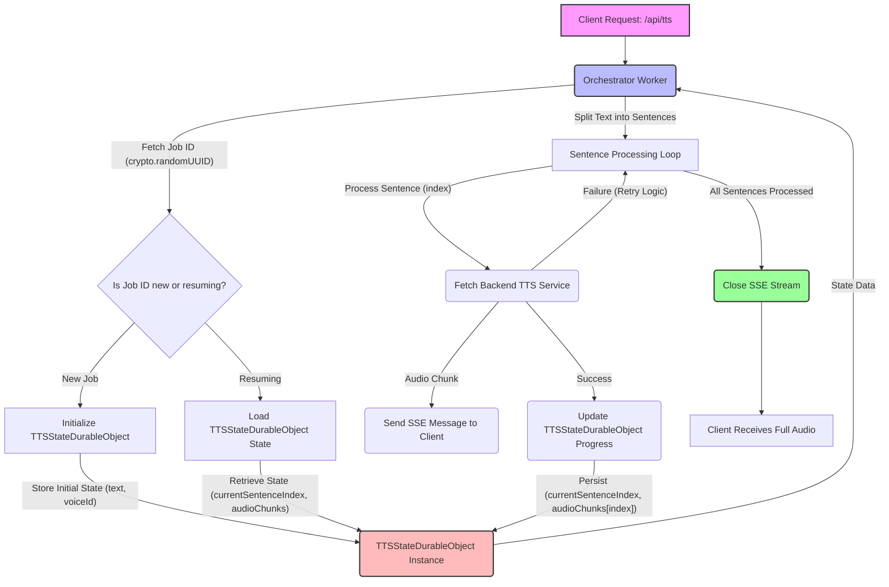

# Detailed Plan for Orchestrator Durable Object State Management Optimization

**Goal:** Optimize the existing `TTSStateDurableObject` and its interaction patterns within the orchestrator to ensure efficient and resilient handling of "long TTS requests" under Cloudflare Workers free tier CPU time limits (10ms).

**Current State Analysis:**

*   **Existing `TTSStateDurableObject`:** Already manages `text`, `voiceId`, `currentSentenceIndex`, and `audioChunks`. It provides `initialize`, `updateProgress`, `getJobState`, and `deleteState` methods.
*   **Orchestrator Interaction:** The orchestrator worker interacts with `TTSStateDurableObject` to store and retrieve state, and stream audio chunks via Server-Sent Events.
*   **Cloudflare Workers Free Tier Limits (Critical Impact):**
    *   **CPU Time:** 10ms per request (very restrictive for I/O-bound or compute-intensive tasks).
    *   **Memory:** 128 MB.
    *   **KV Storage:** 100,000 reads, 1,000 writes per day; 1 GB total.
*   **"Long TTS Requests" Definition:** Based on the 10ms CPU limit, even a moderately long multi-sentence TTS request (e.g., more than a few sentences, or sentences requiring significant backend processing time) could exceed this limit due to:
    *   Multiple `fetch` calls to backend TTS services.
    *   Durable Object `state.storage.get()` and `state.storage.put()` operations (which consume CPU time).
    *   JSON serialization/deserialization of state and audio chunks.
    *   SSE streaming logic.

**Problem Statement:** While the `TTSStateDurableObject` technically manages state, its current synchronous `loadState()` on every `fetch` and direct storage of all `audioChunks` could lead to CPU time limit violations and potential memory pressure (though less critical than CPU) for "long TTS requests" on the Cloudflare Workers free tier. The orchestrator's `fetch` handler for TTS requests, which involves multiple subrequests and state updates, is also susceptible.

**Proposed Enhancements and Strategy:**

The core strategy is to minimize synchronous CPU-intensive operations and data transfer within a single Worker invocation, leveraging Durable Object's isolated execution and asynchronous capabilities more effectively.

1.  **Asynchronous State Loading/Saving within Durable Object:**
    *   **Refinement:** Instead of `await this.loadState()` at the beginning of *every* `fetch` in `TTSStateDurableObject`, implement a lazy loading mechanism or ensure state is loaded only once per instance lifetime (similar to `RouterCounter`). The `constructor` or an explicit `connect` method might be more suitable for initial load. Subsequent requests can operate on the in-memory state, persisting changes as needed. This significantly reduces redundant `storage.get` calls.
    *   **Rationale:** Reduces synchronous I/O operations and CPU time spent on state loading for subsequent requests to the same DO instance.

2.  **Optimized Audio Chunk Storage and Retrieval:**
    *   **Refinement:** For very long TTS jobs where `audioChunks` could grow significantly, consider alternatives to storing the entire `audioChunks` array directly in a single KV key.
        *   **Option A: Chunking Audio Chunks:** Store `audioChunks` in smaller, indexed segments (e.g., `audioChunks_0`, `audioChunks_1`). The DO would manage indices, and the orchestrator would request ranges. This adds complexity but mitigates large single KV object sizes.
        *   **Option B: External Storage References:** If audio chunks become extremely large, store references (e.g., URLs to R2 buckets or other blob storage) in the `audioChunks` array, rather than the base64 encoded data itself. This would offload storage and retrieval of large binaries from Durable Object storage, reducing KV operations and memory footprint within the DO. **This is likely an overkill for typical TTS and introduces external dependencies.**
    *   **Recommendation (Initial):** For now, focus on efficient in-memory management within the DO. The current approach of storing the `audioChunks` array is acceptable given the 128MB memory limit, as long as the cumulative size of audio chunks doesn't approach this limit for a *single* Durable Object instance. The primary concern is the *CPU cost of serializing/deserializing* this array and transferring it on `get-state`.

3.  **Streamlined Orchestrator-Durable Object Interaction:**
    *   **Refinement:** The orchestrator's `handleTtsRequest` already fetches state. The concern is the cumulative CPU usage.
    *   **Progress Updates:** Ensure `updateProgress` in the DO is efficient. It currently updates two keys (`currentSentenceIndex`, `audioChunks`). This is reasonable.
    *   **Batching `audioChunks` Updates (Advanced):** Instead of updating `audioChunks` on every single sentence completion, consider batching updates. For example, update the Durable Object every N sentences or after a certain time interval. This would reduce `storage.put` calls but increases the risk of losing progress if the Worker fails between batches. Given the `MAX_CONCURRENT_SENTENCE_FETCHES`, updating per sentence might be acceptable if the individual `put` operations are fast enough.

4.  **Robust Error Handling and Resumability:**
    *   **Refinement:** The existing `index.mjs` handles retries for backend services and logs errors. The `TTSStateDurableObject` should store more detailed error information (e.g., last error message, timestamp of error, attempts made) to facilitate better debugging and potential resume points.
    *   **`currentSentenceIndex` Reliability:** The `currentSentenceIndex` is crucial for resumability. Ensure its updates are atomic and reliable.

**Architectural Diagram (Conceptual):**

**Test Strategy (if enhancements are implemented):**

If enhancements are implemented based on the above, the test strategy would focus on:

1.  **CPU Time Limit Compliance:**
    *   **Unit Tests:** For `TTSStateDurableObject` methods (`initialise`, `updateProgress`, `getJobState`, `loadState`), mock `state.storage` operations and measure their CPU consumption.
    *   **Integration Tests:** Simulate "long TTS requests" with varying sentence counts and text lengths. Measure the total CPU time of the orchestrator's `fetch` handler. Introduce assertions to fail if CPU time exceeds the 10ms limit for single invocations. This will likely require a custom test runner that can measure CPU time.
2.  **State Management Robustness:**
    *   **Resumability Tests:** Simulate partial TTS generation, worker crashes, and then attempt to resume from the last known good state. Verify that the correct `currentSentenceIndex` and `audioChunks` are loaded and processing continues correctly.
    *   **Concurrency Tests:** Simulate multiple concurrent requests to the same `TTSStateDurableObject` instance to ensure state updates are handled correctly and no race conditions occur.
    *   **Data Integrity:** Verify that `text`, `voiceId`, `currentSentenceIndex`, and `audioChunks` are persisted and retrieved accurately, especially with large `audioChunks` arrays.
3.  **Error Handling and Retry Logic:**
    *   **Backend Service Failures:** Simulate various backend TTS service failures (e.g., 500 errors, 429 rate limits, network timeouts) and verify that the retry logic in `index.mjs` functions as expected, and that `TTSStateDurableObject` accurately reflects any persistent error states.
    *   **Durable Object Failures (Edge Case):** Though rare, consider how the system would behave if the Durable Object itself experiences an unhandled error during a state update.