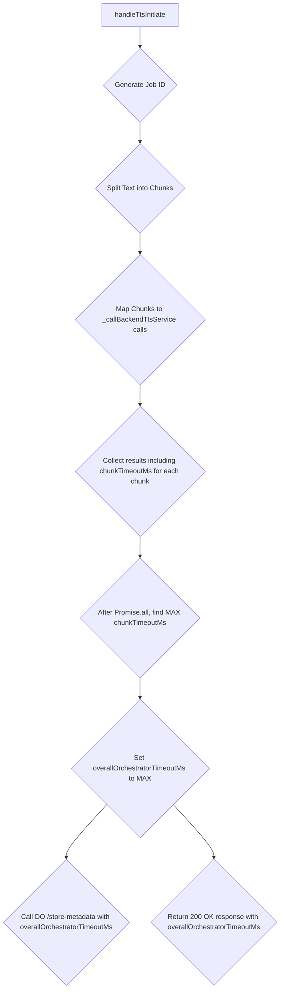

# Orchestrator-Centric Timeout Management Plan

This plan addresses the consistency and propagation of the `timeoutMs` value (referred to as `orchestratorTimeoutMs` in the review) within the TTS orchestration system. The core principle is that the orchestrator is the sole source of truth for this calculation, and the calculated value will be communicated to the client and persistently stored for robust job management.

## Key Principles:

1.  **Orchestrator as Source of Calculation:** The `timeoutMs` will be calculated exclusively within the `_callBackendTtsService` function in the orchestrator. This value is dynamic, based on the `characterCount` of each text chunk.
2.  **Client Information:** The calculated `overallOrchestratorTimeoutMs` will be provided to the client in the initial `handleTtsInitiate` response.
3.  **Durable Object as Persistent Record:** The calculated `overallOrchestratorTimeoutMs` will be stored in the Durable Object as part of the job's metadata to maintain a persistent record for job management, auditing, and consistency across orchestrator instances.

## Detailed Plan:

### 1. Retain `timeoutMs` calculation per chunk in `_callBackendTtsService`

*   The existing calculation logic for `timeoutMs` (lines 196-197 in `orchestrator/src/index.mjs`) will remain in `_callBackendTtsService`. This calculation uses the `characterCount` of the *current chunk*.
*   `_callBackendTtsService` will be modified to explicitly return this calculated `timeoutMs` value along with its other results (`success`, `audioContentBase64`, `mimeType`).

```mermaid
graph TD
    A[_callBackendTtsService(chunkText, ..., characterCount)] --> B{Calculate timeoutMs based on characterCount of chunk};
    B --> C{Perform Backend TTS Call for chunk};
    C --> D{Return { success, audioContentBase64, mimeType, timeoutMs: chunkTimeoutMs }};
```

### 2. Update `handleTtsInitiate` to derive overall `orchestratorTimeoutMs`

*   When `handleTtsInitiate` maps over sentences to call `_callBackendTtsService`, it will capture the `chunkTimeoutMs` returned for each individual chunk.
*   After all `chunkPromises` resolve (`await Promise.all(chunkPromises)`), the function will iterate through the results to find the *maximum* `chunkTimeoutMs`. This `maximum chunkTimeoutMs` will be designated as the `overallOrchestratorTimeoutMs` for the entire job. This ensures that the client receives a timeout that accounts for the longest possible processing time of any single chunk.
*   **Store in Durable Object:** This `overallOrchestratorTimeoutMs` will be included in the `body` of the `POST` request to the Durable Object's `/store-metadata` endpoint. This ensures the job's specific timeout setting is persistently recorded.
*   **Return to Client:** The `overallOrchestratorTimeoutMs` will also be included in the JSON response body of `handleTtsInitiate` (the 200 OK response), providing the client with the necessary timeout information for their polling logic.



### 3. Modify `TTS_DURABLE_OBJECT` to store and retrieve `orchestratorTimeoutMs`

*   **`/store-metadata` handler:** Update this endpoint to accept `orchestratorTimeoutMs` (the overall value) as a parameter in the request body and store it in the Durable Object's storage alongside other job metadata.
*   **`/retrieve` handler:** Modify this endpoint to retrieve and include the stored `orchestratorTimeoutMs` when responding with job metadata.

```mermaid
graph TD
    N[TTS_DURABLE_OBJECT] --> O{/store-metadata};
    O --> P{Persist overallOrchestratorTimeoutMs with job metadata};
    N --> Q{/retrieve};
    Q --> R{Retrieve and return overallOrchestratorTimeoutMs};