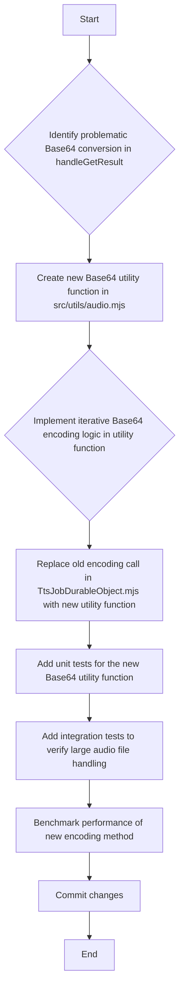

# Architectural Review: Addressing Large Audio File Base64 Encoding

## Concern to Address:
1.  **File:** [`src/durable_objects/TtsJobDurableObject.mjs`](src/durable_objects/TtsJobDurableObject.mjs)
    **Category:** Bug
    **Description:** In `handleGetResult`, the conversion from `ArrayBuffer` to Base64 using `btoa(String.fromCharCode(...new Uint8Array(arrayBuffer)))` can lead to a "Maximum call stack size exceeded" error for large audio files. This is because the spread operator (`...`) attempts to pass all elements of the `Uint8Array` as arguments to `String.fromCharCode` at once, which has a limit. For robust handling of potentially large binary data, consider an iterative approach or a more specialized utility function for Base64 encoding.

## High-Level Solution:
The primary solution involves replacing the problematic Base64 encoding method with an iterative or chunk-based approach. This will prevent the `Maximum call stack size exceeded` error by avoiding a single, large function call.

## Architectural Considerations:

*   **Performance:** The new encoding method should be efficient, minimizing any performance degradation for smaller files while ensuring stability for larger ones. Benchmarking with various audio file sizes will be crucial.
*   **Memory Management:** The iterative approach will reduce the peak memory footprint during Base64 conversion, which is vital in a serverless environment like Cloudflare Workers where memory limits can be strict.
*   **Code Reusability and Maintainability:** The Base64 encoding logic should be extracted into a dedicated utility function. This promotes a cleaner codebase, makes the logic easily testable, and allows for reuse if similar conversions are needed elsewhere. A good place for this would be in `src/utils/audio.mjs`.
*   **Backward Compatibility:** Ensure that the generated Base64 string remains compatible with existing client-side decoding mechanisms. As Base64 is a standard, this should not be an issue if the implementation adheres to the specification.
*   **Error Handling:** The existing `try-catch` block in `handleGetResult` will catch general errors, but the new utility function should also incorporate robust error handling for edge cases during chunk processing.

## Detailed Plan:

## Steps:

1.  **Review `handleGetResult` in `src/durable_objects/TtsJobDurableObject.mjs`:**
    *   Confirm the exact line and context of the `btoa(String.fromCharCode(...new Uint8Array(arrayBuffer)))` call.

2.  **Create/Update `src/utils/audio.mjs`:**
    *   Add a new asynchronous utility function, e.g., `arrayBufferToBase64(buffer)`.
    *   This function will take an `ArrayBuffer` as input and return its Base64 encoded string representation.

3.  **Implement Iterative Base64 Encoding:**
    *   Inside the `arrayBufferToBase64` function, implement a chunk-based conversion.
    *   A common pattern involves reading the `Uint8Array` in smaller segments, converting each segment to a string using `String.fromCharCode.apply(null, chunk)`, and then concatenating these strings before applying `btoa`. This avoids the `Maximum call stack size exceeded` error.
    *   Alternatively, for a more modern approach, one could explore using `TextDecoder` and `TextEncoder` in conjunction with `btoa` if the `ArrayBuffer` is known to represent valid text, but for arbitrary binary audio data, the chunked `String.fromCharCode` approach is generally more direct. Given the context of audio data, the chunking approach is safer.

4.  **Modify `src/durable_objects/TtsJobDurableObject.mjs`:**
    *   Import the new `arrayBufferToBase64` utility function.
    *   Replace the problematic line 180:
        `const base64Audio = btoa(String.fromCharCode(...new Uint8Array(arrayBuffer)));`
        with:
        `const base64Audio = await arrayBufferToBase64(arrayBuffer);`

5.  **Add Unit Tests for `arrayBufferToBase64`:**
    *   Create or update a test file (e.g., `test/utils/audio.test.mjs`) to include tests for the new `arrayBufferToBase64` function.
    *   Include test cases for small, medium, and crucially, large `ArrayBuffer` inputs to ensure it handles all sizes correctly without error.

6.  **Add Integration Tests for `handleGetResult`:**
    *   Modify existing integration tests or create new ones (e.g., in `test/handlers/tts.test.mjs` or `test/performance/audio-performance.test.mjs`) to specifically test the `handleGetResult` endpoint with large audio files.
    *   These tests should simulate storing and retrieving large audio files to confirm the fix for the "Maximum call stack size exceeded" error.

7.  **Benchmark Performance:**
    *   After implementing and testing, conduct performance benchmarks to measure the impact of the new Base64 encoding method on overall response times for `handleGetResult`, especially with large audio files. Compare against baseline measurements if available.

8.  **Commit Changes:**
    *   Commit the changes with a clear and concise commit message, including the co-authorship line.